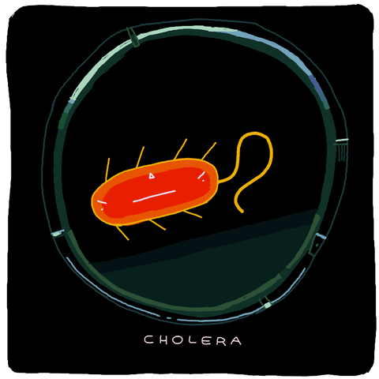

# Background

## Overview
In this simulation, a 2027 space expedition to an uncharted exoplanet results in the accidental return of a novel and highly lethal pathogen. Upon returning to Earth, astronauts unknowingly released a parasitic organism by contact during post-mission analysis of extraterrestrial samples. The organism, a cholera-like parasite with advanced resilience, has a 3-day incubation period before manifesting symptoms.
Initially resembling a common cold, the infection rapidly escalates, causing respiratory issues, severe diarrhea, plague-like boils, and extreme dehydration. Infected individuals may require up to 10 gallons of water per day. This demand places a critical strain on local water supplies. The parasite reproduces asexually, remains highly contagious even after host death, and can jump between hosts with alarming efficiency.
The CDC has traced the outbreak to Blacksburg, Virginia, now under full quarantine. The outbreak occurred in Blacksburg because the astronauts came to VT to give a post-voyage speech, and Blacksburg was the first place they visited for post-sample analysis. The talk was on a Wednesday, and after its completion, the astronauts reported their symptoms to the Carilion Medical Clinic. Contact tracing began shortly after, since Carillion was unable to identify the disease beyond its similar characteristics to cholera. The organism's durability and mutation rate pose a severe threat to biosecurity and public infrastructure. This simulation explores the catastrophic consequences of disease spread, the vulnerabilities in our biological defense systems, and the urgent need for containment protocols in future space exploration missions.

## Roles and Responsibilities: 
Detailed descriptions of the roles participants can assume, including their specific objectives and points of view.

### Red Team: 
Antagonist Event Creators throughout the simulation  
- Astronauts/Companies like Blue Origin, SpaceX, and NASA, who continuously expand their space exploration missions 
- Astronaut Representative (From X-Spacer): The four astronauts who started the outbreak will have one representative who is in charge of making statements and decisions on their behalf.
- Disinformer #1: An Individual whose sole purpose throughout the simulation is to spread disinformation to as many people as possible.  
- Local Business Representatives (price-gouger reps): As local businesses recognize the demand is higher than the supply for their products, price gouging occurs in the Blacksburg community. All local businesses are represented by one representative who is in charge of making statements and decisions on their behalf.
- Angry Parents Representative: Concerned parents of affected/non-affected students receive one representative who is in charge of making statements and decisions on their behalf.
### Blue Team:

- Centers for Disease Control and Prevention (CDC) 
- Acting Director of the CDC: Receives updates and makes statements based on the decisions, actions, and updates of the Director of the National Center for Emerging and Zoonotic Infectious Diseases at CDC. Speaks for the whole of the CDC organization. 
- Director of the National Center for Emerging and Zoonotic Infectious Diseases at the CDC: Responsible for investigating the issue, communicating regularly with the acting director of the CDC. Does not make any updates without concrete health information. Only spreads prevention messaging with updates. 
- U.S. Department of Health and Human Services (Office of Pandemics and Emerging Threats) 
- Director of the Office of Pandemics and Emerging Threats: Boots-on the ground health official with majority of the legal authority in the simulation. Does not state opinions, but instead only updates on their decisions to keep Virginians safe during the simulation. Uses expertise in pandemic research to stop the spread from a national security perspective. 
- Virginia Tech University Leaders 
- University President: Responsible for the welfare of Virginia Tech as a company. Students are a part of the university, so are professors, and each must appear to the public as though they are given equal consideration. In reality, the president is concerned with maintaining the image of Virginia Tech and obtaining more capital for VT when possible. Priorities for this position will constantly change depending on public opinion. 
- University Vice President (Chief Operating Officer): Responsible for updating the University President on current issues and will step in if the president is incapacitated for any reason. Primarily responsible for the image of Virginia Tech and the primary issuer of statements on behalf of the Office of the President. Responsible for quelling the student and parent community.  
- Director of Schiffert Health Center: Responsible for following the advice of all government Healthcare officials. Also responsible for maintaining the health of the unaffected student community with prevention announcements. 
- University Legal Counsel: Lawyers who represent Virginia Tech and Virginia Tech students. They can provide legal advice on what policies can and cannot be put into effect. 
- Students, Professors, and the academic community of Blacksburg
- Student #1: Students at Virginia Tech. These individuals are responsible for the spread of the disease and must follow all university guidance. 
- Student #2: Students at Virginia Tech. These individuals are responsible for the spread of the disease and must follow all university guidance. 
- Professor #1: A Professor at Virginia Tech who is on campus everyday and in contact with students and possibly the astronauts who were speaking.  
- Professor #2: A Professor at Virginia Tech who is on campus everyday and in contact with students and possibly the astronauts who were speaking.
- Townee #1: An individual who lives in Blacksburg. 
- Townee #2: An individual who lives in Blacksburg. 
- Lewis-Gale Staff 
- CEO of Lewis Gale Medical Center: Oversees operations of the hospital and ensures that the hospital is stocked with supplies and staffed properly. The main person who responds to problems within the hospital.   
- Doctor: Responsible for treating patients that have the parasite and preserving the antibiotics that cure infected peoples.  
- Nurse: Responsible for treating patients with the parasite that have come to the hospital for help.  
- Governor of Virginia: Serves as the Chief Executive in Virginia, and can provide assistance and guidance where needed. Responsible for asking for supplies and declaring a State of Emergency if needed. 
- Virginia Department of Health 
- Commissioner of VDH: The Commissioner oversees all VDH operations and is the main contact with the Governor of Virginia to provide updates and information on various diseases.
- Blacksburg Police Department 
- Chief of the Police Department: The Chief of Police is in charge of managing the response of police officers around their district. They ensure that operations are running smoothly throughout the department and that all officers are supported.  
- Police Officer #1: The Police Officer will be responsible for responding to various threats throughout the simulation. They are responsible for ensuring the safety of students, professors, and citizens of Blacksburg. 
- Police Officer #2: The Police Officer will be responsible for responding to various threats throughout the simulation. They are responsible for ensuring the safety of students, professors, and citizens of Blacksburg. 
