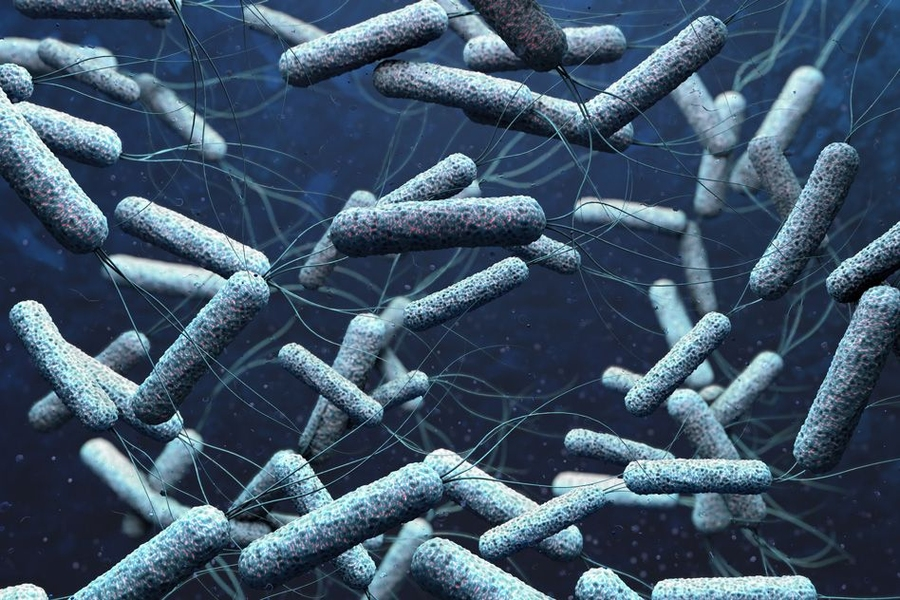

# Cattail Crisis

## Purpose
  The purpose of this simulation is to explore the biological security threats posed by space exploration, specifically focusing on the catastrophic implications of pathogen transmission from extraterrestrial environments to Earth. Set in the aftermath of a 2027 mission to an uncharted exoplanet, this scenario examines the consequences of introducing a resilient, cholera-like parasite into a human population. By tracing the outbreak's origin to a post-mission analysis in Blacksburg, Virginia, the simulation highlights critical vulnerabilities in public health infrastructure, quarantine protocols, and disease identification systems. This exercise underscores the urgent need for advanced biosecurity measures, robust containment strategies, and ethical foresight in space exploration to prevent global crises sparked by alien microorganisms.
  
## Learning Objectives 
1. Understanding how existing risks are exacerbated by a public health crisis**
2. Understanding how disinformation and institutional distrust can worsen the effects of a disease outbreak**
3. Understanding how various institutions coordinate efforts to handle an infectious disease outbreak**
4. Understand and exhibit what a proper post-flight safety procedure should look like** 
5. Exhibit calm and composed behavior when spreading information to the public amidst a crisis**

## How To Navigate 
- If you want to see what phase you're on, click Scenarios or ask your facilitator.  
- If you want to respond to an event, follow the instructions shown on the map tab.  
- If you have any questions, use the FAQ tab
- If you need background information on the event, click Cattail Crisis.
- Those are the big ideas! Explore the rest of the tabs and learn as much as you can about the crisis before responding to your first event in Phase 1. 
